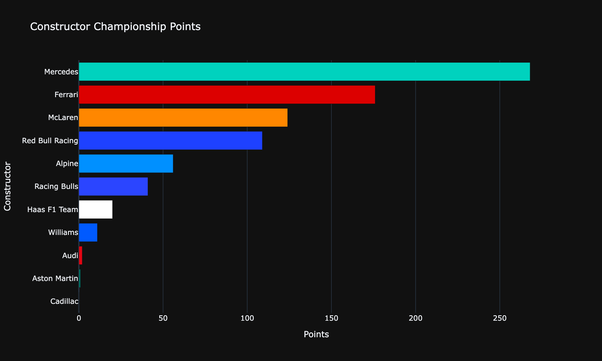
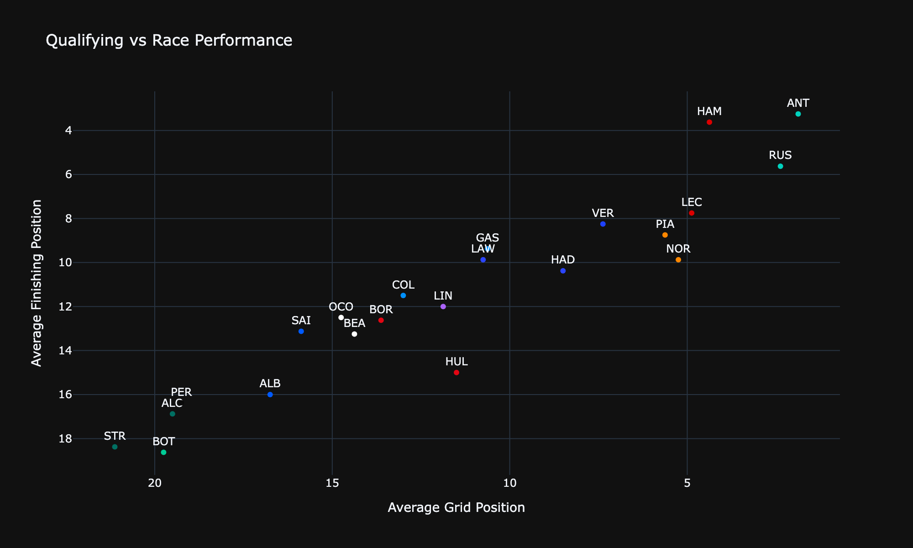

# F1 Data Analysis

Exploratory data analysis of the 2026 F1 season using [FastF1](https://github.com/theOehrly/Fast-F1), with a race-weekend deep dive into Monaco.

## Repository Structure

* `F1_EDA.ipynb` — season-wide exploratory analysis (driver/constructor performance, points, podiums, DNFs)
* `visualisations/` — PNG exports of the notebook's charts
* `monaco2026/` — qualifying and race analysis for the Monaco GP weekend

## Sample Visualisations



Season-to-date constructors' standings; Mercedes leads well clear of Ferrari and McLaren.



Average grid vs. finishing position per driver — points below the diagonal are races won in the car, not on the grid.

More charts are in `visualisations/`; interactive versions live in `F1_EDA.ipynb` (Plotly charts don't render on GitHub — open the notebook locally to view them).

## Tech Stack

Python, FastF1, pandas, NumPy, Plotly, Matplotlib

## Getting Started

```bash
pip install -r requirements.txt
jupyter notebook F1_EDA.ipynb
```

FastF1 caches downloaded session data locally (`cache/`) to avoid re-fetching from the API on every run.
